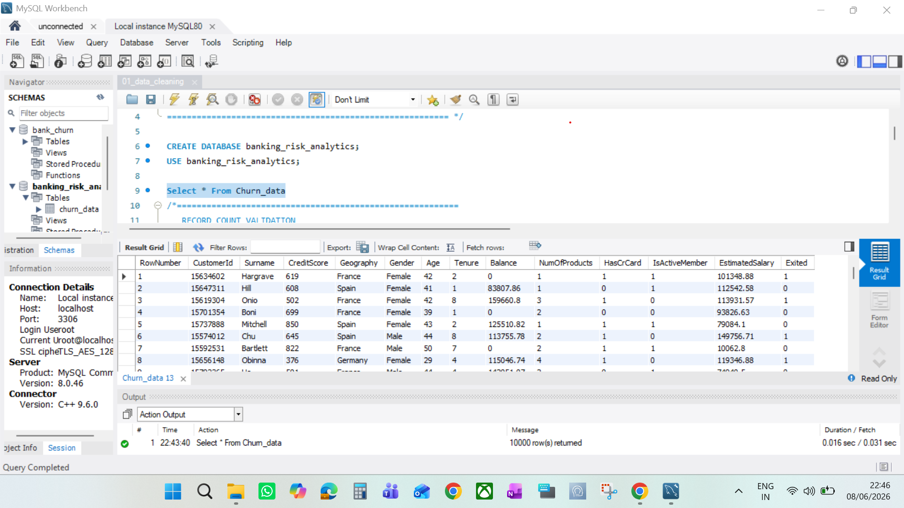
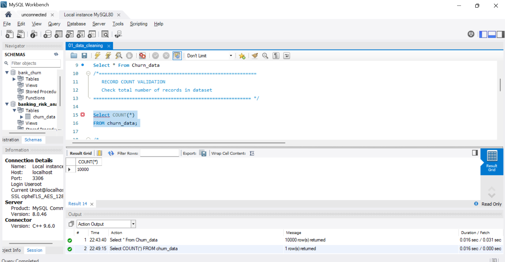
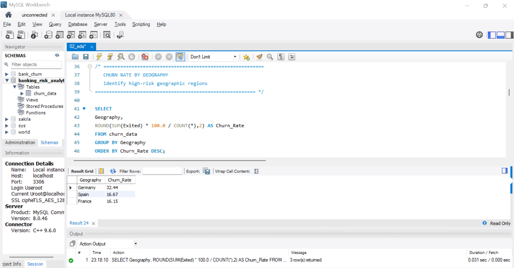
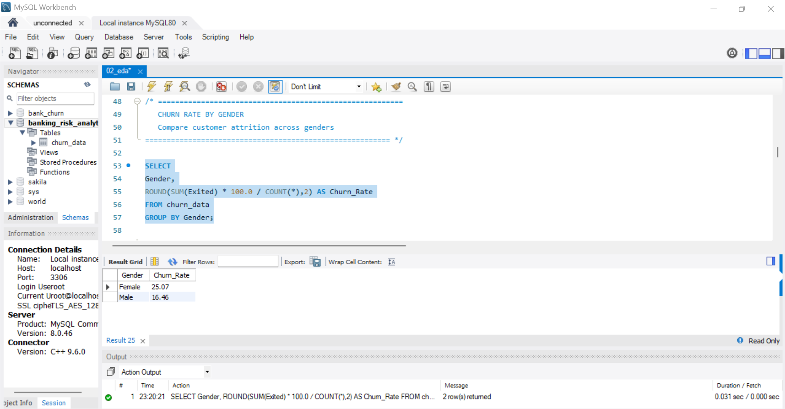
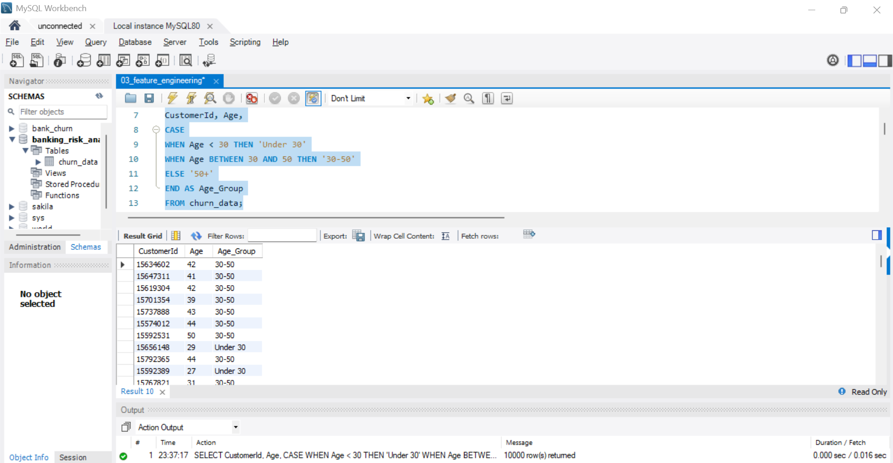
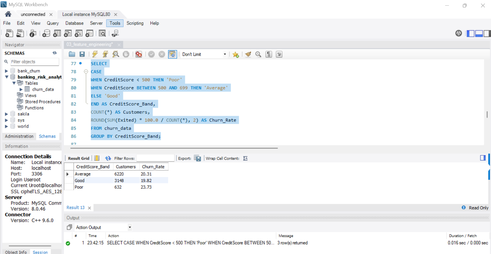

# 📊 Banking Customer Churn Analysis using SQL
## 🎯 Business Problem

A retail bank is experiencing customer attrition and wants to understand the key drivers behind customer churn.
The objective of this project is to analyze customer demographics, account behavior, product ownership, and engagement patterns to identify high-risk customer segments and recommend retention strategies.

🛠️ **Tools & Technologies**

- MySQL
- SQL
- MySQL Workbench
---

## 📂 Dataset Overview

The dataset contains customer-level banking information including:

- Geography
- Age
- Gender
- Credit Score
- Balance
- Product Ownership
- Activity Status
- Churn Status

## 🎯 Project Objective

The goal of this project is to identify the key factors driving customer churn within a retail banking environment. 
Using SQL, the analysis focuses on customer demographics, financial behaviour, product ownership patterns, and engagement levels to uncover high-risk customer segments.
The final objective is to transform raw banking data into meaningful business insights that can support customer retention strategies.

## Step-by-Step Process

### 1️⃣ Data Preparation & Quality Validation

Before performing any analysis, the dataset was validated to ensure data quality and consistency.

The following checks were performed:

- Record count validation
- Duplicate record detection
- Missing value assessment
- Dataset structure verification

### SQL techniques used:

- COUNT()
- CASE WHEN
- Aggregate Functions
- GROUP BY
## 📄 View SQL Code:  View SQL Code: [Data Cleaning Queries](01_data_cleaning.sql)

### 2️⃣ Exploratory Data Analysis (EDA)

After validating the dataset, exploratory analysis was performed to understand customer behaviour and identify potential churn patterns.

The analysis focused on:

- Churn distribution
- Geographic churn comparison
- Age-group behaviour
- Activity status impact
- Product ownership trends

### SQL techniques used:

- GROUP BY
- ORDER BY
- Aggregate Functions
- Conditional Analysis
- Percentage Calculations

## 📄 View SQL Code: [EDA Queries](./02_eda.sql)

### 3️⃣ Feature Engineering

To improve analytical depth, several business-focused features were created from existing customer attributes.

New derived variables were introduced to simplify customer segmentation and identify risk patterns more effectively.

Features created:

- Age Groups
- Credit Score Bands
- Balance Segments
- Activity Categories

### SQL techniques used:

- CASE WHEN
- Custom Categorisation
- Derived Columns
- Business Rule Logic

## 📄 View SQL Code: [Feature Engineering Queries](./03_feature_engineering.sql)

### 4️⃣ Business Analysis & Insight Generation

After preparing and enriching the dataset, business-focused analysis was conducted to identify customer segments most likely to churn.

The objective was to convert analytical findings into actionable business intelligence.

Analysis performed:

- Country-wise churn ranking
- Customer risk scoring
- Customer segment risk analysis
- Retention opportunity identification

### SQL techniques used:

- CTEs (Common Table Expressions)
- Window Functions
- Ranking Logic
- Multi-step Business Queries
- Customer Segmentation

## 📄 View SQL Code: [Business Analysis Queries](./04_business_analysis.sql)

## Executive Summary

The analysis identified multiple customer segments exhibiting significantly elevated churn risk.

- Overall churn rate was 20.37%.
- Germany recorded the highest churn rate (32.44%) among all geographies.
- Female customers churned at 25.07%, compared to 16.46% for male customers.
- Customers aged 50+ exhibited the highest churn rate (44.65%), more than double the overall churn rate.
- Inactive customers churned at 26.85%, compared to 14.27% for active customers.
- Customers holding 3 or more products showed unusually high churn behaviour and require further investigation.

## 💡 Key Insights

### 1. Customer Activity Strongly Influences Retention

Inactive customers consistently demonstrated a significantly higher likelihood of churn compared to active customers. Customer engagement appears to be one of the strongest indicators of long-term retention.

### 2. Churn Risk Increases with Age

Older customer segments showed noticeably higher churn rates than younger groups, suggesting that customer expectations and banking needs may differ across age categories.

### 3. Geography Plays an Important Role

Customer attrition rates varied across regions, indicating that local market conditions, competition, and customer behaviour patterns may influence retention outcomes.

### 4. Product Ownership Alone Does Not Guarantee Loyalty

Customers holding multiple banking products were not automatically less likely to churn. Product adoption must be accompanied by meaningful engagement and customer value.

### 5. Credit Score Patterns Reveal Distinct Risk Segments

Certain credit score bands displayed elevated churn behaviour, highlighting opportunities for targeted retention programs and personalised financial offerings.

### 6. High-Risk Customer Segments Can Be Identified Early

By combining demographic, financial, and behavioural indicators, customer groups with elevated churn risk can be identified before attrition occurs.

## 📈 Business Recommendations

### 1. Develop Age-Specific Retention Strategies

Different customer age groups have different banking expectations. Personalised offers and communication strategies can improve retention within high-risk age segments.

### 2. Focus Retention Efforts on High-Risk Regions

Regions with elevated churn rates should receive targeted retention initiatives, customer feedback programs, and competitive product reviews.

### 3. Strengthen Customer Engagement Beyond Product Sales

Rather than focusing solely on cross-selling products, banks should encourage meaningful product usage and ongoing customer interaction.

### 4. Build a Proactive Churn Monitoring Framework

Customer activity status, credit score category, age group, and product ownership can be combined into a simple risk-scoring model to identify customers requiring immediate attention.

# 👩‍💻 Author

### Vinita Bhardwaj

### Aspiring Business Analyst | SQL | Excel | Power BI

📧 Email: (mailto:Vinni1999bhardwaj@gmail.com)

🔗 LinkedIn: (https://www.linkedin.com/in/vinita-bhardwaj-2a9627227 )

🔗 GitHub: (https://github.com/vinni1999bhardwaj-code)

